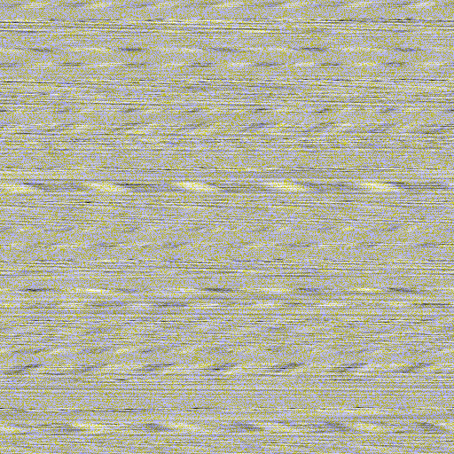

# encoding_audio_as_images
This is kind of an experiment of mine that i applied in the Google Cloud Hack local event, where i proposed and applied a 2-way transformation on some wav samples.

The theoretical postulate is simple - fitting data - as the values range for WAV samples is [-32k to 32k] -> 64k in total unique values.
You can fit the actual audio data in an image format.

If you continue to apply the idea some possible outcomes that i presumed applicable ->

AI applicabiltiy:
- Allows for the employment of all the models that work with images as input data streams.
- Generation of unique "musical" images based on the trained inputs (Generation of new music that fits your taste)
- Classification of music samples by simillarity to the trained network. (Liked songs recommendation specific to your trained dataset)
- And the hardest idea that came to mind to test out - training a diffusion network to know only these inputs.

General applicability:
- Now your images can have sound attached to them (that is if we find an efficient way to encode and decode the data in real time) (and if a way to store the data onto the original image itself without destroying it, you can even sign the image with your audio sample of your voice, so i.e you can speak through images)

All in all this is a simple idea that i have taken some steps towards. On a dataset of 1.2k images it took 1 google cloud node 1.5 hrs to train a classifcation dataset with AutoML.

